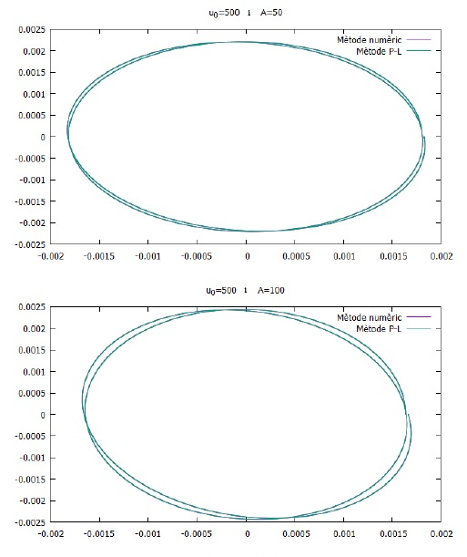

# Bertrand-Theorem-by-Poincar--Lindstedt-method
Using the Poincaré-Lindstedt method we demonstrate the Bertrand Theorem that describes the central forces that move the planets in orbit. 
When choosing a certain central force we parametrize such force and obtain the trajectory equation. That parametrization is what the poincare_lindstedt.c is about.
Later we demonstrate the Bertrand theorem using this code numerical_method.c discretizing the second Newton law and getting a file with the data that later will be plotted with GnuPlot.

